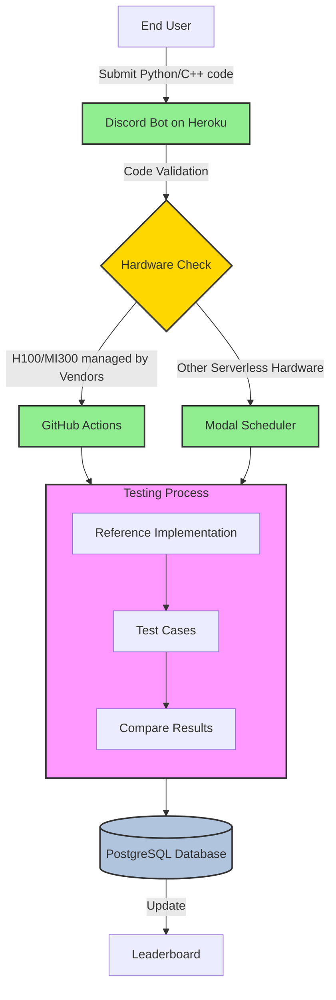
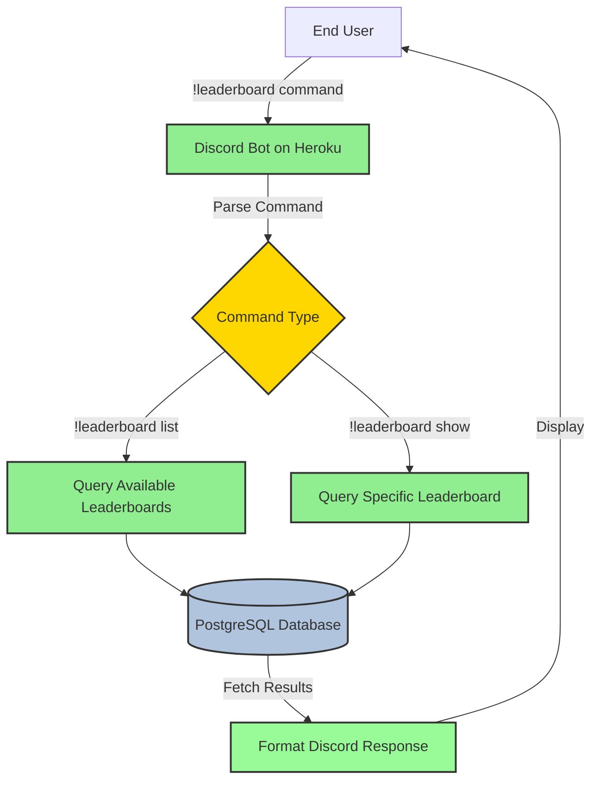

## Leaderboard submit

```mermaid
flowchart TD
    A[End User] -->|Submit Python/C++ code| B[Discord Bot on Heroku]
    
    B -->|Code Validation| C{Hardware Check}
    C -->|H100/MI300 managed by Vendors| D[GitHub Actions]
    C -->|Other Serverless Hardware| E[Modal Scheduler]
    
    subgraph Testing[Testing Process]
        direction TB
        F[Reference Implementation] --> G[Test Cases]
        G --> H[Compare Results]
    end
    
    D --> Testing
    E --> Testing
    
    Testing --> I[(PostgreSQL Database)]
    I -->|Update| J[Leaderboard]
    
    style Testing fill:#f9f,stroke:#333,stroke-width:2px
    
    %% Add some descriptions
    classDef process fill:#90EE90,stroke:#333,stroke-width:2px;
    classDef database fill:#B0C4DE,stroke:#333,stroke-width:2px;
    classDef decision fill:#FFD700,stroke:#333,stroke-width:2px;
    
    class B,D,E process;
    class I database;
    class C decision;

```

## Leaderboard show/list

```mermaid
flowchart TD
    A[End User] -->|!leaderboard command| B[Discord Bot on Heroku]
    
    B -->|Parse Command| C{Command Type}
    
    C -->|!leaderboard list| D[Query Available Leaderboards]
    C -->|!leaderboard show| E[Query Specific Leaderboard]
    
    D --> F[(PostgreSQL Database)]
    E --> F
    
    F -->|Fetch Results| G[Format Discord Response]
    G -->|Display| A
    
    classDef process fill:#90EE90,stroke:#333,stroke-width:2px
    classDef database fill:#B0C4DE,stroke:#333,stroke-width:2px
    classDef decision fill:#FFD700,stroke:#333,stroke-width:2px
    classDef response fill:#98FB98,stroke:#333,stroke-width:2px
    
    class B,D,E process
    class F database
    class C decision
    class G response
```
