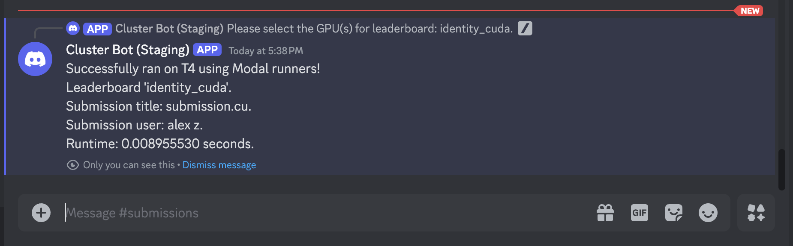
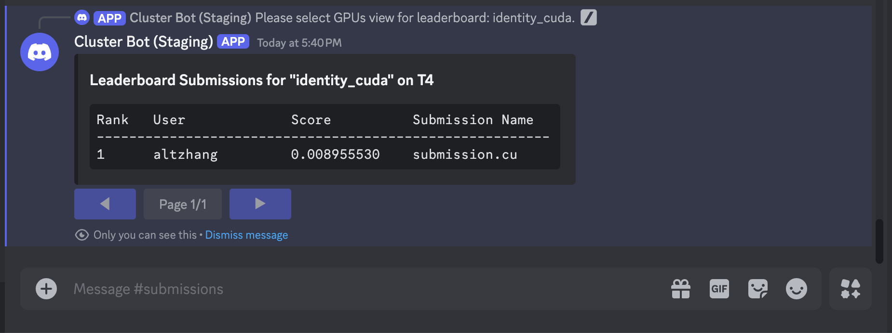

# Submitting to CUDA/C++ Leaderboards
CUDA/C++ leaderboards use a `.cuh` reference kernel and expect a `.cu/.cuh`
submission file from the user. This is a bit of an implementation detail, 
but the Discord bot will compile the evaluation harness as the main file, and treat the
leaderboard `reference_code` and user submission file as header files `.cuh`.


## Analyzing the Leaderboard Specifications
We will submit to the `identity_cuda` leaderboard, which is just an identity kernel in CUDA/C++. We can
actually view exactly what this leaderboard expects by looking at the reference code. To start, type
`/leaderboard reference-code identity_cuda`. The Discord bot will send you a `.cuh` file with the
following function signatures:

```cpp title="identity_cuda_reference_code.cuh"
const int Ns[10] = {128,  256,  512,   1024,  2048,
                    4096, 8192, 16384, 32768, 65536};

// Define the input and output types
using input_t = std::array<std::vector<float>, N_SIZES>;
using output_t = input_t;

bool check_implementation(output_t custom_output, output_t ref_output) {
    ...
}

input_t generate_input() {
    ...
}

output_t reference(input_t input) {
    return static_cast<output_t>(out);
}
```
You can read through the exact implementation details if you'd like as the file is quite small. To
better understand how to write a kernel on this leaderboard, it is easy to understand how we evaluate user submitted kernels. 
Under the hood, the basic submission flow is as follows:
1. The evaluation harness will call `data = generate_input() -> input_t` to produce an `input_t`
   object. This will typically be a `array[vector<float>]`, or just a list of tensors to evaluate on.
2. The evaluation harness will take the `input_t` data and pass it through both
   `ref_kernel(input_t data) -> output_t` and a user-defined `submission(input_t data) -> output_t`.
3. The evaluation harness will check the correctness of the user-defined `submission()` against the
   `ref_kernel` using the leaderboard-defined `check_implementation(output_t ref_out, output_t submission_out)`.

The idea here is that `input_t` could actually be multiple inputs (e.g. `(float, float,
torch.Tensor)`), a batch of inputs, etc. The leaderboard creator will specify how to check for
correctness, and you can view all of this logic for each leaderboard. In the example above,
`input_t = output_t = array[vector<float>, 10]`, but this need not be the case.

## Submission Files
Submission files are generally flexible, but to interface easily with our evaluation scaffolding, we
require submission files to **define and implement** the following function signature (**the
function that gets called by our harness is `submission`**). Note that we automatically convert
your submission into a `.cuh` header, so you don't need to treat your file that way.

```cpp title="submission.cu"
// Type aliases for input_t, output_t defined by leaderboard...

// User kernel implementation.
output_t submission(input_t input) {
    ...
}
```

The `input_t` and `output_t` are generics defined by the leaderboard (you can view the
leaderboard reference code that defines these types, see [Available Discord
Commands](discord-cluster-manager/docs/available-discord-commands)), and are typically going to be
of the form `std::array<std::vector<float>, N_TENSORS>`. We choose this generic format to allow for things like multiple
inputs as a tuple, as well as multiple differently sized Tensor inputs. Furthermore, the leaderboard creator
can define whether to allocate data directly on the GPU, or have it start on the CPU. 

An example of a valid identity kernel submission for the leaderboard above is:

```cpp title="identity_submission.cu"
#include <array>
#include <vector>
#include "reference.cuh"

__global__ void copy_kernel(float *input, float *output, int N)
{
    int idx = blockIdx.x * blockDim.x + threadIdx.x;
    if (idx < N)
    {
        output[idx] = input[idx];
    }
}

output_t submission(input_t data)
{
    output_t result;

    for (int i = 0; i < N_SIZES; ++i)
    {
        int N = Ns[i];
        result[i].resize(N);

        // Allocate device memory
        float *d_input, *d_output;
        cudaMalloc(&d_input, N * sizeof(float));
        cudaMalloc(&d_output, N * sizeof(float));

        // Copy input to device
        cudaMemcpy(d_input, data[i].data(), N * sizeof(float), cudaMemcpyHostToDevice);

        // Launch kernel
        int blockSize = 256;
        int numBlocks = (N + blockSize - 1) / blockSize;
        copy_kernel<<<numBlocks, blockSize>>>(d_input, d_output, N);

        // Copy result back to host
        cudaMemcpy(result[i].data(), d_output, N * sizeof(float), cudaMemcpyDeviceToHost);

        // Free device memory
        cudaFree(d_input);
        cudaFree(d_output);
    }

    return result;
}
```

## Submitting a Basic CUDA Kernel to the Discord Bot
The last step is submitting our kernel above to the Discord bot! In the `#submissions` channel on
Discord, write (I'd suggest typing it out instead of copy-pasting because you have to select the
file from your own file directory):

<center>
```/leaderboard submit modal identity_cuda {submission.cu}``` 
</center>

where you can select `{submission.cu}` from your file directory. Here, we are submitting to the
Modal runners, but we can also replace `modal` with `github` to user the GitHub runners. From a user
perspective, the only difference is what hardware is available on either runner. After submitting
the command, you should see the following UI pop up:

<center></center>

<br></br>

This UI contains a dropdown menu where you can select which GPUs to submit your kernel to. You can
select as many GPUs as you want, and they will each be a part of a different leaderboard. For this
example, select the `T4` GPU, and click anywhere outside the UI. The Discord bot will now create a
thread where you will be able to see if your submission passes / fails, and the runtime (if it
passes all evaluation checks).

<center></center>

<br></br>

## Viewing the Leaderboard
You can now view your ranking on the leaderboard compared to other participants. Type `/leaderboard
show identity_cu`. Another dropdown menu should appear, similar when you submitted your kernel. 
Because we submitted to the `T4` GPU, select the `T4` option in the dropdown. Like for submissions,
you can select multiple GPUs. In this instance, it will display each ranking on each unique GPU.

<center></center>

<br></br>

## Debugging with Discord
We provide many `/` (*"slash"*) commands to help participants understand the leaderboard they are
submitting to. None of the submission pipeline is hidden from the user, and they can access the
entire pipeline source code from slash commands. Some examples of useful commands are:
* `/leaderboard list` to show all active leaderboards and what devices they accept.
* `/leaderboard show {name}` to show the rankings for a particular leaderboard.
* `/leaderboard eval-code {language}` to show the evaluation harness for Python/CUDA leaderboards.
* `/leaderboard reference-code {name}` to get the reference code for the leaderboard.

More details for commands can be found in [Available Discord Commands](discord-cluster-manager/docs/available-discord-commands). 
You are now ready to write CUDA kernels! Play around with other available leaderboards and try to write the fastest kernels ⚡!
