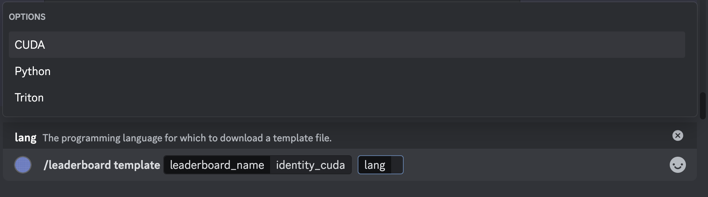
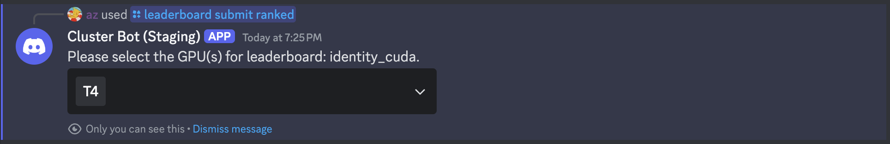
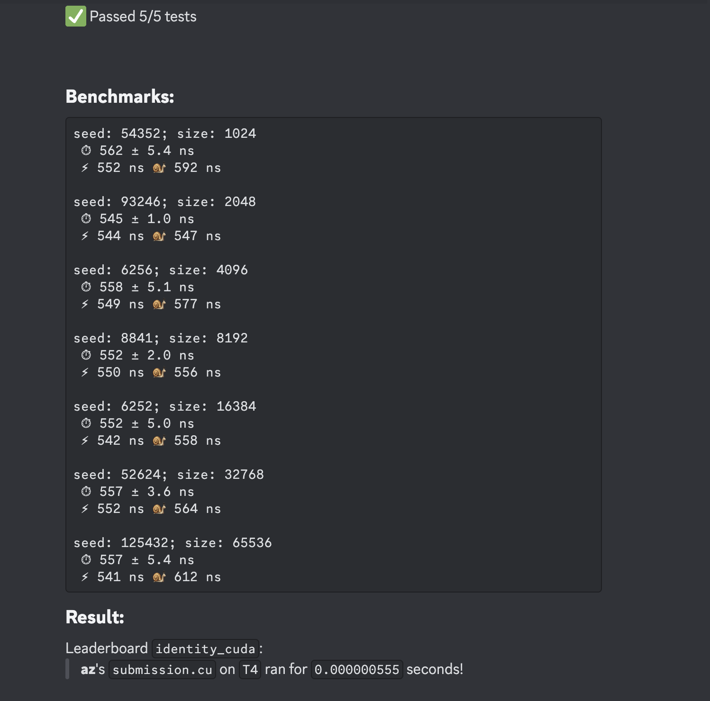

# Submitting to CUDA/C++ Leaderboards
CUDA/C++ leaderboards expect a `.cu` submission file from the user.
This is a bit of an implementation detail, but 
but the Discord bot will compile the submission as the main file, and treat the reference
and eval harness as headers.


## Getting Started: How do Leaderboards Work?
As a simple example, we will submit to the `identity_cuda` leaderboard, which is just an identity kernel in CUDA/C++. We can
actually view exactly what this leaderboard expects by looking at the reference code. To start, type
`/leaderboard task leaderboard_name:identity_cuda`. 

The Discord bot will send you multiple `.h/.cuh` files that are used to run
evaluations. As a user, the interesting files are `reference.cuh` and `task.h`. `reference.cuh`, listed below, shows the
logic for generating inputs, the reference kernel, and the leaderboard-defined correctness checks:

```cpp title="reference.cuh"
#ifndef __REFERENCE_CUH__
#define __REFERENCE_CUH__

#include "task.h"

static void check_implementation(TestReporter& reporter, input_t data, output_t user_output) {
    // Reporter reports whether implementation passed or failed.
    ...
    reporter.pass();
}

static input_t generate_input(int seed) {
    std::mt19937 rng(seed);
    ...
    return ...
}

static output_t ref_kernel(input_t input) {
    ...
    return ...
}

#endif
```
You can read through the exact implementation details if you'd like as the file is quite small. To
better understand how to write a kernel on this leaderboard, it is useful to first understand how we evaluate user submitted kernels. 

Under the hood, the basic submission flow is as follows:
1. **Data generation.** The evaluation harness will call `data = generate_input() -> input_t` to produce an `input_t`
   object. This will typically be a `array<vector<float>>`, i.e. just a list of tensors to evaluate on.
2. **Reference example.** The evaluation harness will take the `input_t` data and pass it through both
   `ref_kernel(input_t data) -> output_t` and a user-defined `custom_kernel(input_t data) -> output_t`.
3. **Correctness logic.** The evaluation harness will check the correctness of the user-defined `custom_kernel()` against the
   `ref_kernel(data)` using the leaderboard-defined `check_implementation(input_t data, output_t custom_out)`.

**Remark.** The key idea here is that `input_t` and `output_t` could actually be multiple inputs (e.g. `(float, float,
torch.Tensor)`), a batch of inputs, etc. The leaderboard creator will specify how to check for
correctness, and you can view all of this logic for each leaderboard. In the example above,
`input_t = output_t = array<vector<float>, 10>`, but in general you should look at `task.h` to get the alias type (you can also
just look at the `ref_kernel` to get an idea for the input/output types); for example:

```cpp title="task.h
#ifndef __POPCORN_TASK_H__
#define __POPCORN_TASK_H__

...
#define N_SIZES 10
const int Ns[N_SIZES] = {128,  256,  512,   1024,  2048,
                         4096, 8192, 16384, 32768, 65536};

using input_t = std::array<std::vector<float>, N_SIZES>;
using output_t = input_t;

#endif
```

## Submission Files
Submission files are generally flexible, but to interface easily with our evaluation scaffolding, we
require submission files to **define and implement** the following function signature (**the
function that gets called by our harness is `custom_kernel`**). 
* ❗ To submit to a particular CUDA leaderboard, write the heading `//!POPCORN leaderboard {leaderboard_name}` (you can also specify the leaderboard in the submission command).

For example, for submitting to the identity kernel leaderboard `identity_cuda`, we can use:
```cpp title="submission.cu"
//!POPCORN leaderboard identity_cuda
#include <array>
#include <vector>

#include "task.h"
#include "utils.h"

__global__ void kernel() {
    // do nothing
}

output_t custom_kernel(input_t data)
{
    return data;
}
```

For any leaderboard, you can also view a beginner example for getting started by typing

<center>
```
/leaderboard template leaderboard_name:{name}
```
</center>

You can specify a particular template from the language keyword, as shown below:
<center></center>

## Submitting to the Official Ranked Leaderboard
The last step is submitting our kernel above to the Discord bot! In the `#submissions` channel on
Discord, write (the `key:value` parameters are named parameters that can be filled in with `value`, such as with a file):

<center>
```/leaderboard submit ranked script:{submission.cu}``` 
</center>

where you can select `{submission.cu}` from your file directory. If you did not include a heading for 
a particular leaderboard, you can also explicitly write the name of the leaderboard to submit to. After submitting
the command, you should see the following UI pop up:

<center></center>

<br></br>

This UI contains a dropdown menu where you can select which GPUs to submit your kernel to. You can
select as many GPUs as you want, and they will each be a part of a different leaderboard. For this
example, select the `T4` GPU, and click anywhere outside the UI. The Discord bot will now create two threads
(one private and one leaderboard submission) where you will be able to see if your submission passes / fails, 
and the runtime (if it passes all evaluation checks). For example, the leaderboard thread prints the following:

<center></center>

<br></br>

## Debugging and Testing Kernel Submissions
The Discord bot can also be used to debug and evaluate kernels without making an official submission to the
leaderboard. We provide two special commands for 1) **test**ing functional kernel correctness and 2) **benchmark**ing
kernel runtime. The same optional arguments and use of `!POPCORN leaderboard {name}` heading from a ranked submission also
apply to the following commands:

### To test for correctness,
<center>
```/leaderboard submit test script:{submission.cu}``` 
</center>

### To benchmark the runtime of your kernel,
<center>
```/leaderboard submit benchmark script:{submission.cu}``` 
</center>

## Viewing the Leaderboard
You can now view your ranking on the leaderboard compared to other participants. Type `/leaderboard
show leaderboard_name:identity_cu`. Another dropdown menu should appear, similar when you submitted your kernel. 
Because we submitted to the `T4` GPU, select the `T4` option in the dropdown. Like for submissions,
you can select multiple GPUs. In this instance, it will display each ranking on each unique GPU.

<center></center>

<br></br>

## Debugging with Discord
We provide many `/` (*"slash"*) commands to help participants understand the leaderboard they are
submitting to. None of the submission pipeline is hidden from the user, and they can access the
entire pipeline source code from slash commands. Some examples of useful commands are:
* `/leaderboard list` to show all active leaderboards and what devices they accept.
* `/leaderboard show leaderboard_name:{name}` to show the rankings for a particular leaderboard.
* `/leaderboard show-personal leaderboard_name:{name}` to show only your submission rankings for a particular leaderboard.
* `/leaderboard task leaderboard_name:{name}` to show the evaluation harness for Python/CUDA leaderboards.

More details for commands can be found in [Available Discord Commands](../available-discord-commands). 
You are now ready to write CUDA kernels! Play around with other available leaderboards and try to write the fastest kernels ⚡!
