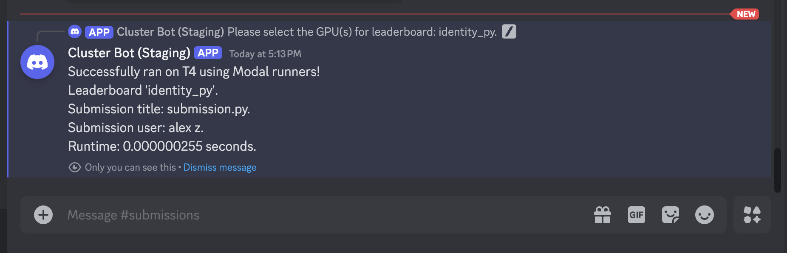

# Submitting to Python Leaderboards
As mentioned earlier, Python leaderboards use a Python reference kernel and expect a Python
submission file from the user. The only restriction is that the user submits **exactly one file that
is in Python**, but participants can still submit CUDA code through [inlining CUDA code](https://pytorch.org/tutorials/advanced/custom_ops_landing_page.html#custom-ops-landing-page) or writing
a [CUDA extension / pybinding](https://pytorch.org/tutorials/advanced/cpp_extension.html).


## Analyzing the Leaderboard Specifications
We will submit to the `identity_py` leaderboard, which is just an identity kernel in Python. We can
actually view exactly what this leaderboard expects by looking at the reference code. To start, type
`/leaderboard reference-code identity_py`. The Discord bot will send you a `.py` file with the
following function signatures:

```python title="identity_py_reference_code.py"
# More generically, a leaderboard needs to define an InputType
# and OutputType. They do not need to be List[torch.Tensor]

def check_implementation(
        custom_output: List[torch.Tensor], 
        ref_output: List[torch.Tensor]
    ) -> bool:
    ...

# Generate returns InputType
def generate_input() -> List[torch.Tensor]:
    ...

def ref_kernel(xs: List[torch.Tensor]) -> List[torch.Tensor]:
    return xs
```
You can read through the exact implementation details if you'd like as the file is quite small. To
better understand how to write a kernel on this leaderboard, it is easy to understand how we evaluate user submitted kernels. 
Under the hood, the basic submission flow is as follows:
1. The evaluation harness will call `data = generate_input() -> InputType` to produce an `InputType`
   object. This will typically be a `List[torch.Tensor]`, or just a list of tensors to evaluate on.
2. The evaluation harness will take the `InputType` data and pass it through both
   `ref_kernel(InputType data) -> OutputType` and a user-defined `custom_kernel(InputType data) -> OutputType`.
3. The evaluation harness will check the correctness of the user-defined `custom_kernel` against the
   `ref_kernel` using the leaderboard-defined `check_implementation(OutputType ref_out, OutputType
    submission_out)`.

The idea here is that `InputType` could actually be multiple inputs (e.g. `(float, float,
torch.Tensor)`), a batch of inputs, etc. The leaderboard creator will specify how to check for
correctness, and you can view all of this logic for each leaderboard. In the example above,
`InputType = OutputType = List[torch.Tensor]`, but this need not be the case.

## Submission Files
Submission files are generally flexible, but to interface easily with our evaluation scaffolding, we
require submission files to **define and implement** the following function signature (**the
function that gets called by our harness is `custom_kernel`**):

```python title="submission.py"
# InputType, OutputType defined by leaderboard...

# User kernel implementation.
def custom_kernel(input: InputType) -> OutputType:
    # Implement me...
```

The `InputType` and `OutputType` are generics defined by the leaderboard (you can view the
leaderboard reference code that defines these types, see [Available Discord
Commands](../available-discord-commands)), and are typically going to be
of the form `List[torch.Tensor]`. We choose this generic format to allow for things like multiple
inputs as a tuple, as well as multiple differently sized Tensor inputs. For example, an identity kernel might look like:

```python title="identity_submission.py"
from typing import List
import torch

# Here, InputType = OutputType = List[torch.Tensor]
def custom_kernel(input: List[torch.Tensor]) -> List[torch.Tensor]:
    return input
```

## Submitting a Basic Python Kernel to the Discord Bot
The last step is submitting our kernel above to the Discord bot! In the `#submissions` channel on
Discord, write (I'd suggest typing it out instead of copy-pasting because you have to select the
file from your own file directory):

<center>
```/leaderboard submit modal identity_py {submission.py}``` 
</center>

where you can select `{submission.py}` from your file directory. Here, we are submitting to the
Modal runners, but we can also replace `modal` with `github` to user the GitHub runners. From a user
perspective, the only difference is what hardware is available on either runner. After submitting
the command, you should see the following UI pop up:

<center></center>

<br></br>

This UI contains a dropdown menu where you can select which GPUs to submit your kernel to. You can
select as many GPUs as you want, and they will each be a part of a different leaderboard. For this
example, select the `T4` GPU, and click anywhere outside the UI. The Discord bot will now create a
thread where you will be able to see if your submission passes / fails, and the runtime (if it
passes all evaluation checks).

<center></center>

<br></br>

## Viewing the Leaderboard
You can now view your ranking on the leaderboard compared to other participants. Type `/leaderboard
show identity_py`. Another dropdown menu should appear, similar when you submitted your kernel. 
Because we submitted to the `T4` GPU, select the `T4` option in the dropdown. Like for submissions,
you can select multiple GPUs. In this instance, it will display each ranking on each unique GPU.

<center></center>

<br></br>

## Debugging with Discord
We provide many `/` (*"slash"*) commands to help participants understand the leaderboard they are
submitting to. None of the submission pipeline is hidden from the user, and they can access the
entire pipeline source code from slash commands. Some examples of useful commands are:
* `/leaderboard list` to show all active leaderboards and what devices they accept.
* `/leaderboard show {name}` to show the rankings for a particular leaderboard.
* `/leaderboard eval-code {language}` to show the evaluation harness for Python/CUDA leaderboards.
* `/leaderboard reference-code {name}` to get the reference code for the leaderboard.

More details for commands can be found in [Available Discord Commands](../available-discord-commands). 
You are now ready to write Python kernels! Play around with other available leaderboards and try to write the fastest kernels ⚡!
