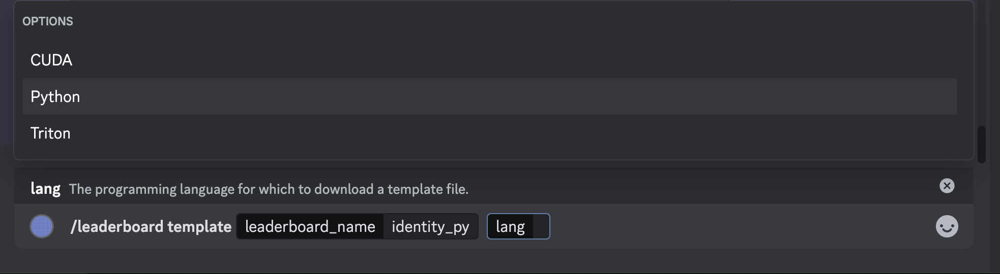
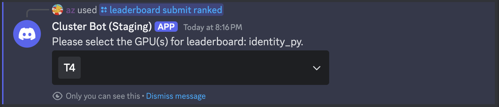
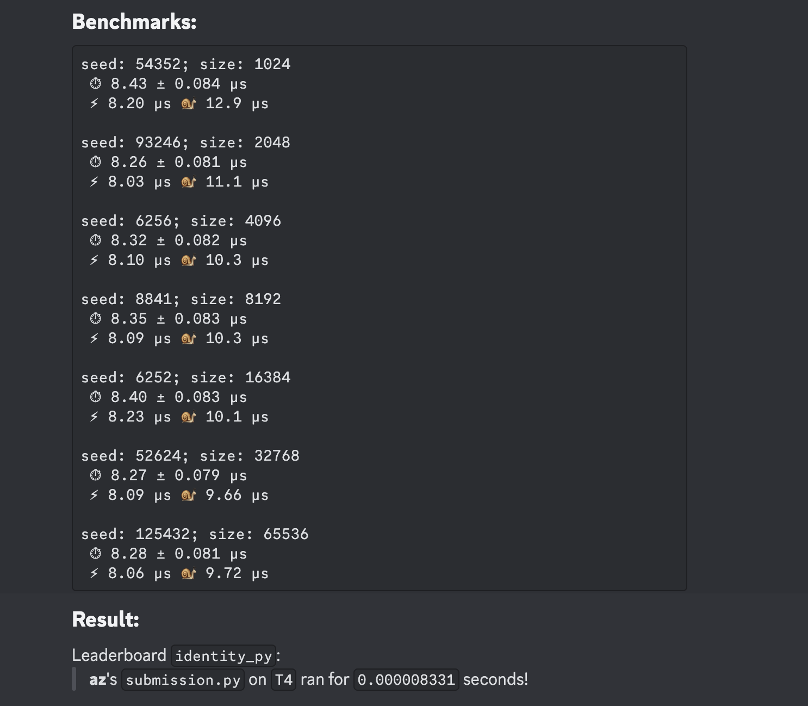
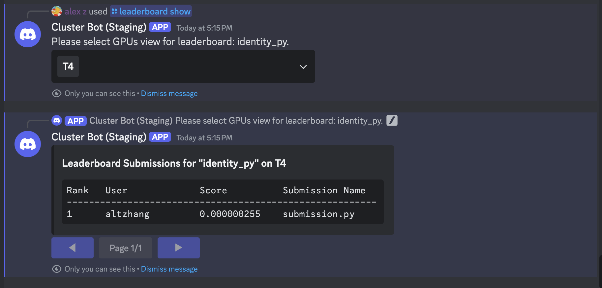

# Submitting to Python Leaderboards
As mentioned earlier, Python leaderboards **expect a Python
submission file** from the user. The only restriction is that the user submits **exactly one file that
is in Python**, but participants can still submit CUDA code through [inlining CUDA code](https://pytorch.org/docs/stable/cpp_extension.html#torch.utils.cpp_extension.load_inline) or writing
a [CUDA extension / pybinding](https://pytorch.org/tutorials/advanced/custom_ops_landing_page.html#custom-ops-landing-page).


## Getting Started: How do Leaderboards Work?
As a simple example, we will submit to the `identity_py` leaderboard, which is just an identity kernel in Python. We can
actually view exactly what this leaderboard expects by looking at the reference code. To start, type

<center>
```
/leaderboard task leaderboard_name:identity_py
```
</center>

The Discord bot will send you multiple `.py` files that are used to run
evaluations. As a user, the interesting files are `reference.py` and `task.py`. `reference.py`, listed below, shows the
logic for generating inputs, the reference kernel, and the leaderboard-defined correctness checks:

```python title="reference.py"
from task import input_t, output_t, ...

def check_implementation(
        input: input_t,
        custom_output: output_t,
    ) -> str:
    # Empty string denotes success
    reference_output = ref_kernel(input)
    ...
    return ''

# Generate returns InputType
def generate_input(..., seed: int) -> input_t:
    gen = torch.Generator(device='cuda')
    gen.manual_seed(seed)
    ...
    return ...

def ref_kernel(input: input_t) -> output_t:
    ...
    return ...
```
You can read through the exact implementation details if you'd like as the file is quite small. To
better understand how to write a kernel on this leaderboard, it is useful to first understand how we evaluate user submitted kernels. 


#### Under the hood, the basic submission flow is as follows:
1. **Data generation.** The evaluation harness will call `data = generate_input() -> input_t` to produce an `input_t`
   object. `input_t` will typically be an alias for `torch.Tensor`, but it is flexible enough to represent any type of input.
2. **Reference example.** The evaluation harness will take the `input_t` data and pass it through both
   `ref_kernel(data: input_t) -> output_t` and a user-defined `custom_kernel(data: input_t) -> output_t`.
3. **Correctness logic.** The evaluation harness will check the correctness of the user-defined `custom_kernel` against the
   `ref_kernel` using the leaderboard-defined `check_implementation(ref_out: output_t, submission_out: output_t)`.

**Remark**. The key idea here is that `input_t` and `output_t` could actually be multiple inputs (e.g. `(float, float,
torch.Tensor)`), a batch of inputs, etc. The leaderboard creator will specify how to check for
correctness, and you can view all of this logic for each leaderboard. In the example above,
`input_t = output_t = torch.Tensor`, but in general you should look at `task.py` to get the alias type (you can also just look at 
the `ref_kernel` to get an idea for the input/output types); for example:

```python title="task.py"
import torch

...

input_t = list[torch.Tensor]
output_t = input_t
```

## Submission Files
Submission files are generally flexible, but to interface easily with our evaluation scaffolding, we
require submission files to **define and implement** the following function signature (**the
function that gets called by our harness is `custom_kernel`**).  
* ❗ To submit to a particular Python leaderboard, write the heading `#!POPCORN leaderboard {leaderboard_name}` (you can also specify the leaderboard in the submission command).

For example, for submitting to the identity kernel leaderboard `identity_py`, we can use:

```python title="submission.py"
#!POPCORN leaderboard identity_py
from task import input_t, output_t

# User kernel implementation.
def custom_kernel(input: input_t) -> output_t:
    return input
```

For any leaderboard, you can also view a beginner example for getting started by typing

<center>
```
/leaderboard template leaderboard_name:{name}
```
</center>

You can specify a particular template from the language keyword, as shown below:
<center></center>

## Submitting to the Official Ranked Leaderboard
The last step is submitting our kernel above to the Discord bot! In the `#submissions` channel on
Discord, write (the `key:value` parameters are named parameters that can be filled in with `value`, such as with a file):

<center>
```/leaderboard submit ranked script:{submission.py}``` 
</center>

where you can select `{submission.py}` from your file directory. If you did not include a heading for 
a particular leaderboard, you can also explicitly write the name of the leaderboard to submit to. After submitting
the command, you should see the following UI pop up:

<center></center>

<br></br>

This UI contains a dropdown menu where you can select which GPUs to submit your kernel to. You can
select as many GPUs as you want, and they will each be a part of a different leaderboard. For this
example, select the `T4` GPU, and click anywhere outside the UI. The Discord bot will now create two threads
(one private and one leaderboard submission) where you will be able to see if your submission passes / fails, 
and the runtime (if it passes all evaluation checks). For example, the leaderboard thread prints the following:

<center></center>

<br></br>

## Debugging and Testing Kernel Submissions
The Discord bot can also be used to debug and evaluate kernels without making an official submission to the
leaderboard. We provide two special commands for 1) **test**ing functional kernel correctness and 2) **benchmark**ing
kernel runtime. The same optional arguments and use of `!POPCORN leaderboard {name}` heading from a ranked submission also
apply to the following commands:

### To test for correctness,
<center>
```/leaderboard submit test script:{submission.py}``` 
</center>

### To benchmark the runtime of your kernel,
<center>
```/leaderboard submit benchmark script:{submission.py}``` 
</center>

## Viewing the Leaderboard
You can now view your ranking on the leaderboard compared to other participants. Type `/leaderboard
show leaderboard_name:identity_py`. Another dropdown menu should appear, similar when you submitted your kernel. 
Because we submitted to the `T4` GPU, select the `T4` option in the dropdown. Like for submissions,
you can select multiple GPUs. In this instance, it will display each ranking on each unique GPU.

<center></center>

<br></br>

## Debugging with Discord
We provide many `/` (*"slash"*) commands to help participants understand the leaderboard they are
submitting to. None of the submission pipeline is hidden from the user, and they can access the
entire pipeline source code from slash commands. Some examples of useful commands are:
* `/leaderboard list` to show all active leaderboards and what devices they accept.
* `/leaderboard submit benchmark gpu:{gpu} leaderboard_name:{name} script:{script}` to benchmark a code submission for a leaderboard.
* `/leaderboard show leaderboard_name:{name}` to show the rankings for a particular leaderboard.
* `/leaderboard show-personal leaderboard_name:{name}` to show only your submission rankings for a particular leaderboard.
* `/leaderboard task leaderboard_name:{name}` to show the evaluation harness for Python/CUDA leaderboards.

More details for commands can be found in [Available Discord Commands](../available-discord-commands). 
You are now ready to write Python kernels! Play around with other available leaderboards and try to write the fastest kernels ⚡!
